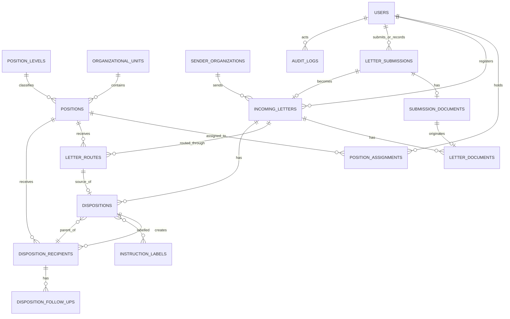

# Database Schema — Sistem Disposisi Surat

## 1. Tujuan

Dokumen ini mendefinisikan struktur database untuk Sistem Disposisi Surat berdasarkan `system-design.md`.

Schema harus mendukung:

* surat masuk;
* struktur organisasi dan pergantian pejabat;
* RBAC;
* routing awal oleh Bagian Umum;
* disposisi hierarkis;
* multiple recipients;
* disposition tree;
* status setiap branch;
* tindak lanjut;
* private document versioning;
* SHA-256 document integrity;
* audit trail;
* laporan periodik.

Detail exact state transition tetap didefinisikan pada `workflow-spec.md`.

---

# 2. Konvensi Database

Gunakan relational database.

Primary key internal menggunakan `BIGINT`/Laravel default ID.

ID acak bukan mekanisme authorization. Mengetahui ID sebuah record tetap harus melewati Policy.

Semua timestamp sistem disimpan secara konsisten dan timestamp tindakan bisnis berasal dari server.

Core business record tidak boleh di-hard-delete melalui workflow normal.

Gunakan:

* foreign key;
* unique constraint;
* check constraint jika didukung;
* index berdasarkan pola query;
* transaction untuk operasi multi-record.

Gunakan JSON hanya untuk data yang memang tidak membutuhkan relational constraint, terutama metadata audit.

---

# 3. High-Level ERD



---

# 4. Authentication dan RBAC

## `users`

Menggunakan schema authentication Laravel yang dipilih.

Minimal:

| Column            | Type      | Constraint   |
| ----------------- | --------- | ------------ |
| id                | bigint    | PK           |
| name              | varchar   | required     |
| email             | varchar   | unique       |
| password          | varchar   | required     |
| email_verified_at | timestamp | nullable     |
| account_type      | varchar(20) | required, default `PUBLIC` |
| is_active         | boolean   | default true |
| created_at        | timestamp |              |
| updated_at        | timestamp |              |

Field MFA mengikuti authentication stack Laravel yang digunakan.

Nilai `account_type` MVP:

```text
PUBLIC
INTERNAL
```

`account_type` merupakan server-owned trust boundary, bukan Role.

Public self-registration selalu menghasilkan:

```text
account_type = PUBLIC
```

Account `INTERNAL` hanya boleh dibuat atau dipromosikan melalui proses provisioning
administratif yang authorized dan diaudit. Nilai `account_type`, `is_active`, Role,
Permission, dan Position tidak boleh diterima sebagai trusted input dari public
registration.

Existing user pada saat migration boundary diperkenalkan menggunakan default
`PUBLIC` agar perubahan bersifat fail-closed terhadap privilege internal.

Jangan menyimpan jabatan pada tabel `users`.

Jangan membuat:

```text
users.role
users.position
users.is_walikota
users.is_sekda
```

karena Role dan Position mempunyai lifecycle berbeda.

---

## RBAC Tables

Jika menggunakan Spatie Laravel Permission, gunakan tabel package:

```text
roles
permissions
model_has_roles
model_has_permissions
role_has_permissions
```

Jangan membuat sistem RBAC custom lain di samping package tersebut tanpa kebutuhan nyata.

Role mengatur **capability aplikasi**, bukan hierarchy disposisi.

---

# 5. Struktur Organisasi

## `organizational_units`

Merepresentasikan unit/bagian organisasi.

Contoh:

```text
Bagian Hukum
Bagian Pemerintahan
Bagian Aset
Bagian Umum
```

| Column     | Type         | Constraint                            |
| ---------- | ------------ | ------------------------------------- |
| id         | bigint       | PK                                    |
| parent_id  | bigint       | FK nullable → organizational_units.id |
| code       | varchar(50)  | unique nullable                       |
| name       | varchar(150) | required                              |
| is_active  | boolean      | default true                          |
| created_at | timestamp    |                                       |
| updated_at | timestamp    |                                       |

`parent_id` memungkinkan struktur unit dikembangkan di masa depan tanpa mengubah schema.

---

## `position_levels`

Merepresentasikan level dalam workflow organisasi.

Contoh data MVP:

```text
GENERAL_AFFAIRS
EXECUTIVE_ENTRY
ASSISTANT
SECTION_HEAD
```

Wali Kota dan Sekda sama-sama berada pada `EXECUTIVE_ENTRY`.

| Column          | Type              | Constraint   |
| --------------- | ----------------- | ------------ |
| id              | bigint            | PK           |
| code            | varchar(50)       | unique       |
| name            | varchar(100)      | required     |
| hierarchy_order | unsigned smallint | required     |
| is_active       | boolean           | default true |
| created_at      | timestamp         |              |
| updated_at      | timestamp         |              |

`hierarchy_order` membantu memahami urutan tetapi bukan satu-satunya sumber authorization.

Workflow transition tetap divalidasi oleh domain rule.

---

## `positions`

Merepresentasikan jabatan konkret.

Contoh:

```text
Wali Kota
Sekretaris Daerah
Asisten I
Asisten II
Asisten III
Kepala Bagian Hukum
Kepala Bagian Aset
```

| Column                 | Type         | Constraint                            |
| ---------------------- | ------------ | ------------------------------------- |
| id                     | bigint       | PK                                    |
| position_level_id      | bigint       | FK → position_levels.id               |
| organizational_unit_id | bigint       | FK nullable → organizational_units.id |
| code                   | varchar(80)  | unique                                |
| name                   | varchar(150) | required                              |
| is_active              | boolean      | default true                          |
| created_at             | timestamp    |                                       |
| updated_at             | timestamp    |                                       |

Index:

```text
position_level_id
organizational_unit_id
is_active
```

Jangan menghapus Position yang sudah mempunyai histori.

Gunakan `is_active = false`.

---

## `position_assignments`

Merepresentasikan siapa menduduki jabatan tertentu pada suatu periode.

| Column              | Type      | Constraint             |
| ------------------- | --------- | ---------------------- |
| id                  | bigint    | PK                     |
| user_id             | bigint    | FK → users.id          |
| position_id         | bigint    | FK → positions.id      |
| started_at          | timestamp | required               |
| ended_at            | timestamp | nullable               |
| assigned_by_user_id | bigint    | FK nullable → users.id |
| created_at          | timestamp |                        |
| updated_at          | timestamp |                        |

Constraint:

```text
ended_at IS NULL
OR
ended_at > started_at
```

Index:

```text
user_id
position_id
(position_id, ended_at)
(user_id, ended_at)
```

Invariant MVP:

> Satu Position hanya mempunyai satu assignment aktif pada waktu yang sama.

Karena constraint interval sulit dibuat portable lintas database, invariant ini wajib ditegakkan melalui Service + transaction + automated test.

Assignment lama tidak dihapus.

Ketika pejabat berganti:

```text
assignment lama → ended_at diisi
assignment baru → record baru
```

---

## Aturan Operasional Master Organisasi

Schema yang ada sudah mencukupi M2 dan tidak memerlukan tabel tambahan.
Constraint operasional berikut ditegakkan pada Policy, Form Request, Action, dan
transaction:

* `position_levels` adalah katalog workflow terlindungi dan hanya di-exact-sync
  melalui `organization:sync-levels`;
* unit induk wajib aktif dan perubahan `parent_id` tidak boleh membentuk siklus;
* unit tidak dapat dinonaktifkan selama mempunyai unit turunan aktif atau
  Position aktif;
* kode unit tidak dapat diubah setelah dibuat;
* Position baru hanya dapat memakai Position Level resmi yang aktif dan unit
  aktif;
* `positions.code` dan `positions.position_level_id` immutable setelah dibuat;
* Position tidak dapat dinonaktifkan selama mempunyai Position Assignment aktif;
* Assignment baru hanya menerima account `INTERNAL` yang aktif dan terverifikasi;
* `started_at` dan `ended_at` selalu ditentukan server;
* assign, replace, dan end menggunakan row locking dan audit pada transaction
  yang sama;
* tidak tersedia endpoint hard delete untuk unit, Position, Position Level, atau
  Position Assignment.

Filter dan pagination halaman organisasi dilakukan pada query server. Riwayat
assignment hanya dimuat untuk Position yang dipilih agar daftar utama tidak
memuat histori tanpa batas.

---

# 6. Instansi Pengirim

## `sender_organizations`

Master instansi/organisasi pengirim surat.

| Column     | Type         | Constraint   |
| ---------- | ------------ | ------------ |
| id         | bigint       | PK           |
| name       | varchar(200) | required     |
| address    | text         | nullable     |
| contact    | varchar(150) | nullable     |
| is_active  | boolean      | default true |
| created_at | timestamp    |              |
| updated_at | timestamp    |              |

Index:

```text
name
is_active
```

Master ini penting untuk laporan berdasarkan instansi pengirim.

Jangan menghapus instansi yang sudah digunakan surat lama.

---

# 7. Submission / Intake

## `letter_submissions`

Merepresentasikan intake sebelum surat diregistrasi secara resmi oleh Bagian Umum.

| Column                       | Type         | Constraint                                  |
| ---------------------------- | ------------ | ------------------------------------------- |
| id                           | bigint       | PK                                          |
| public_id                    | char(26)     | ULID, unique, server-generated              |
| source                       | varchar(20)  | required                                    |
| status                       | varchar(30)  | required                                    |
| submitted_by_user_id         | bigint       | FK nullable → users.id                      |
| recorded_by_user_id          | bigint       | FK nullable → users.id                      |
| sender_organization_name     | varchar(200) | required                                    |
| contact_name                 | varchar(150) | required                                    |
| contact_email                | varchar(255) | required                                    |
| contact_phone                | varchar(30)  | nullable                                    |
| external_letter_number       | varchar(100) | nullable                                    |
| external_letter_date         | date         | nullable                                    |
| subject                      | varchar(255) | required                                    |
| summary                      | text         | nullable                                    |
| submitted_at                 | timestamp    | nullable                                    |
| created_at                   | timestamp    |                                             |
| updated_at                   | timestamp    |                                             |

Nilai `source`:

```text
ONLINE
MANUAL
```

Nilai `status` dan transition mengikuti `workflow-spec.md`:

```text
DRAFT
SUBMITTED
REGISTERED
REJECTED
```

Invariant kepemilikan:

```text
ONLINE → submitted_by_user_id required, recorded_by_user_id null
MANUAL → submitted_by_user_id null, recorded_by_user_id required
```

Untuk online submission, `contact_name` dan `contact_email` merupakan snapshot server-side dari authenticated user pada saat draft dibuat. Field trust boundary, source, status, actor, dan timestamp tidak pernah dipercaya dari frontend.

`public_id` digunakan untuk route dan response publik. Sequential bigint `id` tetap menjadi key internal dan tidak diekspos sebagai identifier publik.

Index:

```text
UNIQUE (public_id)
source
status
submitted_at
(submitted_by_user_id, status)
(submitted_by_user_id, created_at)
```

## `submission_documents`

Menyimpan tepat satu dokumen PDF aktif untuk satu submission.

| Column                       | Type            | Constraint                         |
| ---------------------------- | --------------- | ---------------------------------- |
| id                           | bigint          | PK                                 |
| letter_submission_id         | bigint          | FK → letter_submissions.id, unique |
| storage_disk                 | varchar(50)     | required                           |
| storage_path                 | varchar(500)    | required, unique                   |
| original_filename            | varchar(255)    | required                           |
| mime_type                    | varchar(100)    | required                           |
| size_bytes                   | unsigned bigint | required                           |
| sha256                       | char(64)        | required                           |
| uploaded_by_user_id          | bigint          | FK → users.id                      |
| created_at                   | timestamp       |                                    |
| updated_at                   | timestamp       |                                    |

Dokumen dapat diganti selama submission masih `DRAFT`. Penggantian draft memperbarui satu active document dan wajib menghasilkan audit. Setelah `SUBMITTED`, metadata serta file menjadi immutable.

File disimpan di private storage menggunakan nama server-generated. Nama file asli hanya metadata download, bukan bagian storage path. SHA-256 dihitung saat upload sebagai fingerprint integritas.

---

# 8. Surat Masuk

## `incoming_letters`

Merepresentasikan satu surat masuk yang telah diregistrasi Bagian Umum.

| Column                               | Type         | Constraint                            |
| ------------------------------------ | ------------ | ------------------------------------- |
| id                                   | bigint       | PK                                    |
| letter_submission_id                 | bigint       | FK unique → letter_submissions.id      |
| agenda_number                        | varchar(50)  | required                              |
| agenda_year                          | smallint     | required                              |
| sender_organization_id               | bigint       | FK → sender_organizations.id          |
| external_letter_number               | varchar(100) | nullable                              |
| external_letter_date                 | date         | nullable                              |
| subject                              | varchar(255) | required                              |
| summary                              | text         | nullable                              |
| received_at                          | timestamp    | required                              |
| status                               | varchar(40)  | required                              |
| registered_by_user_id                | bigint       | FK → users.id                         |
| registered_by_position_assignment_id | bigint       | FK nullable → position_assignments.id |
| created_at                           | timestamp    |                                       |
| updated_at                           | timestamp    |                                       |

Unique constraint:

```text
UNIQUE (agenda_year, agenda_number)
```

Index:

```text
sender_organization_id
received_at
status
external_letter_number
(agenda_year, agenda_number)
```

`status` adalah aggregate state surat.

Exact values ditentukan pada `workflow-spec.md`.

Status tidak boleh dikirim bebas dari frontend.

---

# 9. Dokumen Surat

## `letter_documents`

Menyimpan versi dokumen PDF.

| Column               | Type            | Constraint                        |
| -------------------- | --------------- | --------------------------------- |
| id                   | bigint          | PK                                |
| incoming_letter_id   | bigint          | FK → incoming_letters.id          |
| source_submission_document_id | bigint | FK nullable, unique → submission_documents.id |
| version_number       | unsigned int    | required                          |
| replaces_document_id | bigint          | FK nullable → letter_documents.id |
| storage_disk         | varchar(50)     | required                          |
| storage_path         | varchar(500)    | required                          |
| original_filename    | varchar(255)    | required                          |
| mime_type            | varchar(100)    | required                          |
| size_bytes           | unsigned bigint | required                          |
| sha256               | char(64)        | required                          |
| correction_reason    | text            | nullable                          |
| uploaded_by_user_id  | bigint          | FK → users.id                     |
| created_at           | timestamp       | required                          |

Tidak diperlukan `updated_at`.

Document version dianggap immutable setelah dibuat.

Unique:

```text
UNIQUE (incoming_letter_id, version_number)
```

Disarankan:

```text
UNIQUE (incoming_letter_id, sha256)
```

untuk mencegah file identik dibuat sebagai versi baru secara tidak sengaja.

Index:

```text
incoming_letter_id
sha256
created_at
```

File tidak pernah disimpan pada public webroot.

`storage_path` menggunakan nama internal yang dihasilkan server.

---

# 10. Routing Awal Surat

Bagian Umum tidak membuat disposisi substantif.

Karena itu routing awal dipisahkan dari `dispositions`.

## `letter_routes`

Merepresentasikan pengiriman awal surat:

```text
Bagian Umum
     ↓
Wali Kota / Sekda
```

| Column                           | Type        | Constraint                            |
| -------------------------------- | ----------- | ------------------------------------- |
| id                               | bigint      | PK                                    |
| incoming_letter_id               | bigint      | FK → incoming_letters.id              |
| recipient_position_id            | bigint      | FK → positions.id                     |
| routed_by_user_id                | bigint      | FK → users.id                         |
| routed_by_position_assignment_id | bigint      | FK nullable → position_assignments.id |
| status                           | varchar(40) | required                              |
| routed_at                        | timestamp   | required                              |
| completed_at                     | timestamp   | nullable                              |
| created_at                       | timestamp   |                                       |
| updated_at                       | timestamp   |                                       |

Index:

```text
incoming_letter_id
recipient_position_id
status
(recipient_position_id, status)
```

Business invariant:

* recipient wajib Wali Kota atau Sekda;
* hanya route aktif yang boleh menjadi sumber disposisi pertama;
* satu surat hanya mempunyai satu initial route aktif.

Jika terjadi koreksi routing, histori route lama tidak dihapus.

---

# 11. Disposisi

## `dispositions`

Merepresentasikan **satu tindakan disposisi**.

Contoh:

```text
Asisten II membuat disposisi:
"Koordinasikan penanganan kegiatan ini"

Recipient:
- Kabag Kesehatan
- Kabag Aset
```

Ini adalah **satu disposition** dengan dua recipient.

| Column                            | Type      | Constraint                              |
| --------------------------------- | --------- | --------------------------------------- |
| id                                | bigint    | PK                                      |
| incoming_letter_id                | bigint    | FK → incoming_letters.id                |
| source_route_id                   | bigint    | FK nullable → letter_routes.id          |
| parent_recipient_id               | bigint    | FK nullable → disposition_recipients.id |
| created_by_user_id                | bigint    | FK → users.id                           |
| created_by_position_assignment_id | bigint    | FK → position_assignments.id            |
| instruction_note                  | text      | nullable                                |
| created_at                        | timestamp | required                                |

Tidak diperlukan `updated_at`.

Disposition adalah historical action dan tidak diedit setelah dibuat.

Sumber disposition harus salah satu:

```text
source_route_id
```

atau:

```text
parent_recipient_id
```

bukan keduanya.

Secara konseptual:

```text
CHECK (
    exactly one of
    source_route_id / parent_recipient_id
    is not null
)
```

Jika database mendukung CHECK constraint dengan baik, gunakan constraint database.

Jika tidak, enforce pada Service + test.

Interpretasi:

```text
source_route_id
→ disposisi pertama Wali Kota/Sekda

parent_recipient_id
→ disposisi lanjutan dari penerima sebelumnya
```

Index:

```text
incoming_letter_id
source_route_id
parent_recipient_id
created_by_user_id
created_by_position_assignment_id
created_at
```

---

# 12. Recipient dan Branch Disposisi

## `disposition_recipients`

Ini merupakan tabel terpenting untuk branching.

Satu row = satu **branch pekerjaan** untuk satu Position.

| Column                              | Type        | Constraint                            |
| ----------------------------------- | ----------- | ------------------------------------- |
| id                                  | bigint      | PK                                    |
| disposition_id                      | bigint      | FK → dispositions.id                  |
| recipient_position_id               | bigint      | FK → positions.id                     |
| status                              | varchar(40) | required                              |
| received_at                         | timestamp   | nullable                              |
| started_at                          | timestamp   | nullable                              |
| completed_at                        | timestamp   | nullable                              |
| completed_by_user_id                | bigint      | FK nullable → users.id                |
| completed_by_position_assignment_id | bigint      | FK nullable → position_assignments.id |
| completion_note                     | text        | nullable                              |
| created_at                          | timestamp   |                                       |
| updated_at                          | timestamp   |                                       |

Unique:

```text
UNIQUE (disposition_id, recipient_position_id)
```

Satu Position tidak boleh dimasukkan dua kali dalam disposition yang sama.

Index:

```text
disposition_id
recipient_position_id
status
(recipient_position_id, status)
completed_at
```

Contoh:

```text
Disposition #10
    ├── Recipient #21 → Kabag Hukum → COMPLETED
    └── Recipient #22 → Kabag Aset  → IN_PROGRESS
```

Surat belum selesai karena Recipient #22 masih aktif.

---

# 13. Membentuk Disposition Tree

Tree tidak membutuhkan kolom `parent_disposition_id`.

Parent branch sudah diketahui melalui:

```text
dispositions.parent_recipient_id
```

Contoh:

```text
Route #1
→ Sekda

Disposition #1
source_route_id = 1
→ Recipient #1: Asisten II

Disposition #2
parent_recipient_id = Recipient #1
→ Recipient #2: Kabag Hukum
→ Recipient #3: Kabag Aset
```

Tree:

```text
Sekda
  ↓
Asisten II
  ├── Kabag Hukum
  └── Kabag Aset
```

Dengan model ini, parent-child relationship tidak ambigu.

---

# 14. Instruction Labels

## `instruction_labels`

Daftar instruksi configurable.

| Column      | Type         | Constraint   |
| ----------- | ------------ | ------------ |
| id          | bigint       | PK           |
| code        | varchar(80)  | unique       |
| name        | varchar(150) | required     |
| description | text         | nullable     |
| is_active   | boolean      | default true |
| sort_order  | unsigned int | default 0    |
| created_at  | timestamp    |              |
| updated_at  | timestamp    |              |

Contoh:

```text
FOR_INFORMATION
FOLLOW_UP
REVIEW
COORDINATE
ATTEND
PREPARE_RESPONSE
URGENT
```

Jangan gunakan ENUM untuk daftar ini.

---

## `disposition_instruction_label`

Pivot antara disposition dan instruction label.

| Column               | Type   | Constraint                 |
| -------------------- | ------ | -------------------------- |
| disposition_id       | bigint | FK → dispositions.id       |
| instruction_label_id | bigint | FK → instruction_labels.id |

Primary/unique:

```text
UNIQUE (
    disposition_id,
    instruction_label_id
)
```

Label yang sudah pernah digunakan tidak boleh dihapus dari histori.

Jika tidak digunakan lagi:

```text
is_active = false
```

---

# 15. Tindak Lanjut

## `disposition_follow_ups`

Menyimpan catatan tindak lanjut suatu branch.

Ini berbeda dari `AuditLog`.

Audit menjawab:

> apa yang terjadi di sistem?

Follow-up menjawab:

> apa tindak lanjut pekerjaan terhadap surat?

| Column                            | Type      | Constraint                     |
| --------------------------------- | --------- | ------------------------------ |
| id                                | bigint    | PK                             |
| disposition_recipient_id          | bigint    | FK → disposition_recipients.id |
| created_by_user_id                | bigint    | FK → users.id                  |
| created_by_position_assignment_id | bigint    | FK → position_assignments.id   |
| note                              | text      | required                       |
| created_at                        | timestamp | required                       |

Tidak diperlukan `updated_at`.

Follow-up merupakan historical entry dan tidak diedit diam-diam.

Jika salah, lakukan correction melalui mekanisme bisnis yang meninggalkan histori.

Index:

```text
disposition_recipient_id
created_by_user_id
created_at
```

---

# 16. Audit Trail

## `audit_logs`

Audit log bersifat **application-level append-only**.

| Column                       | Type         | Constraint                            |
| ---------------------------- | ------------ | ------------------------------------- |
| id                           | bigint       | PK                                    |
| actor_user_id                | bigint       | FK nullable → users.id                |
| actor_position_assignment_id | bigint       | FK nullable → position_assignments.id |
| action                       | varchar(100) | required                              |
| subject_type                 | varchar(150) | required                              |
| subject_id                   | bigint       | nullable                              |
| old_values                   | json         | nullable                              |
| new_values                   | json         | nullable                              |
| metadata                     | json         | nullable                              |
| request_id                   | varchar(64)  | nullable                              |
| ip_address                   | varchar(45)  | nullable                              |
| user_agent                   | text         | nullable                              |
| created_at                   | timestamp    | required                              |

Tidak ada:

```text
updated_at
deleted_at
```

Index:

```text
actor_user_id
action
(subject_type, subject_id)
created_at
request_id
```

Contoh action:

```text
SUBMISSION_CREATED
SUBMISSION_UPDATED
SUBMISSION_DOCUMENT_REPLACED
SUBMISSION_SUBMITTED
SUBMISSION_DRAFT_DELETED

LETTER_REGISTERED
LETTER_ROUTED
DOCUMENT_VERSION_CREATED
DISPOSITION_CREATED
DISPOSITION_RECEIVED
DISPOSITION_STARTED
DISPOSITION_COMPLETED
FOLLOW_UP_ADDED

ROLE_CHANGED
PERMISSION_CHANGED
INTERNAL_ACCOUNT_PROVISIONED
POSITION_ASSIGNED
POSITION_ENDED
```

Untuk operasi bootstrap atau provisioning melalui trusted console,
`actor_user_id` dapat bernilai `null`. Audit tetap wajib memiliki `request_id`
dan metadata aman yang menjelaskan sumber console serta command yang dijalankan.
Password, argument rahasia, dan secret autentikasi tidak boleh masuk metadata.

Jangan menyimpan:

* password;
* session token;
* MFA secret;
* recovery code;
* isi penuh PDF;
* secret konfigurasi.

---

# 17. Aggregate Letter Status

`incoming_letters.status` disimpan untuk memudahkan:

* inbox;
* filtering;
* dashboard;
* reporting.

Tetapi source of truth workflow adalah:

```text
letter_routes
+
disposition_recipients
```

Contoh:

```text
Kabag Hukum → COMPLETED
Kabag Aset  → IN_PROGRESS
```

menghasilkan:

```text
incoming_letters.status = IN_PROGRESS
```

Status aggregate hanya boleh diperbarui oleh application/service layer dalam transaction yang sama dengan perubahan branch.

Frontend tidak boleh langsung menentukan status surat.

---

# 18. Workflow Invariants

### Submission

* Public User hanya dapat mengakses online submission miliknya.
* Draft dapat diedit, mengganti satu dokumen aktif, dan dihapus oleh pemilik.
* Submitted submission immutable bagi Public User.
* `submitted_at` null pada `DRAFT` dan wajib terisi mulai `SUBMITTED`.
* Setiap transition dan mutasi penting menghasilkan append-only audit.

Invariant berikut wajib dijaga oleh Service + Policy + automated test.

### Registration

```text
IncomingLetter
harus dibuat oleh user berwenang dari Bagian Umum
```

### Initial Route

```text
Bagian Umum
→ Wali Kota / Sekda
```

Tidak boleh:

```text
Bagian Umum → Asisten
Bagian Umum → Kepala Bagian
```

### First Disposition

```text
Wali Kota / Sekda
→ Asisten
```

Tidak boleh:

```text
Wali Kota → Kepala Bagian
Sekda → Kepala Bagian
```

### Second Disposition

```text
Asisten
→ satu atau lebih Kepala Bagian
```

Kepala Bagian menjadi terminal formal MVP.

### Recipient

Recipient harus:

* Position aktif;
* berada pada hierarchy yang valid;
* tidak duplikat dalam disposition yang sama.

### Completion

Satu branch hanya dapat diselesaikan oleh user yang memiliki Position Assignment aktif terhadap Position recipient tersebut, kecuali terdapat permission khusus yang secara eksplisit mengizinkan tindakan lain.

### Letter Completion

Surat hanya selesai ketika seluruh terminal branch aktif telah selesai.

---

# 19. Delete Policy

Core domain record tidak di-hard-delete melalui aplikasi normal.

Pengecualian terkontrol adalah `letter_submissions` berstatus `DRAFT` beserta active `submission_documents` miliknya. Draft belum menjadi intake resmi dan hanya dapat dihapus oleh pemilik. Audit penghapusan tetap dipertahankan. Submission selain `DRAFT` tidak boleh dihapus.

## Jangan dihapus

```text
incoming_letters
letter_documents
letter_routes
dispositions
disposition_recipients
disposition_follow_ups
position_assignments
audit_logs
```

Correction dilakukan melalui:

* status;
* new version;
* new assignment;
* explicit correction action.

Master data seperti:

```text
positions
organizational_units
instruction_labels
sender_organizations
```

dinonaktifkan menggunakan:

```text
is_active = false
```

ketika sudah pernah digunakan.

---

# 20. Foreign Key Delete Strategy

Untuk historical business data, default gunakan:

```text
ON DELETE RESTRICT
```

Jangan menggunakan cascade delete dari:

```text
users
positions
incoming_letters
```

ke histori disposisi.

Contoh yang tidak boleh terjadi:

```text
hapus user
    ↓
seluruh disposisi user ikut terhapus
```

Account user sebaiknya dinonaktifkan, bukan dihapus, apabila sudah mempunyai histori.

Cascade hanya boleh digunakan untuk data teknis/pivot yang memang tidak mempunyai nilai historis independen.

---

# 21. Index Minimum

Index awal yang dianggap penting:

```text
letter_submissions:
- public_id
- source
- status
- submitted_by_user_id + status
- submitted_by_user_id + created_at

submission_documents:
- letter_submission_id
- storage_path
- sha256

incoming_letters:
- received_at
- status
- sender_organization_id
- agenda_year + agenda_number

position_assignments:
- user_id
- position_id
- position_id + ended_at

letter_routes:
- recipient_position_id + status
- incoming_letter_id

dispositions:
- incoming_letter_id
- parent_recipient_id
- created_at

disposition_recipients:
- recipient_position_id + status
- disposition_id
- completed_at

letter_documents:
- incoming_letter_id
- sha256

audit_logs:
- actor_user_id
- subject_type + subject_id
- action
- created_at
```

Index tambahan dibuat berdasarkan query nyata dan profiling, bukan tebakan.

---

# 22. Query Utama yang Harus Efisien

## Submission Milik Public User

```text
WHERE source = ONLINE
AND submitted_by_user_id = authenticated_user.id
ORDER BY created_at DESC
```

Authorization collection harus terjadi pada query database, bukan setelah seluruh row diambil.

Schema harus mendukung query berikut dengan baik.

## Inbox Wali Kota / Sekda

```text
letter_routes
WHERE recipient_position_id = active_position
AND status = active
```

## Inbox Asisten / Kepala Bagian

```text
disposition_recipients
WHERE recipient_position_id = active_position
AND status = active
```

## Detail Surat

```text
IncomingLetter
+ current document
+ initial route
+ disposition tree
+ follow-ups
```

tetap dibatasi authorization.

## Reporting Periodik

```text
incoming_letters.received_at
incoming_letters.status
sender_organization_id
disposition_recipients.recipient_position_id
completed_at
```

menjadi sumber utama agregasi.

---

# 23. Transaction Boundaries

## Create / Update / Submit Submission

Create, update, document replacement, submit, dan draft deletion harus menggabungkan business mutation dengan audit record dalam satu database transaction. Transition serta penggantian dokumen menggunakan row lock untuk mencegah race condition.

File storage tidak transactional dengan database. Implementasi wajib membersihkan file baru jika persistence gagal dan membersihkan file lama hanya setelah database replacement berhasil.

Beberapa operasi wajib transactional.

## Registrasi Surat

```text
create incoming letter
→ store document metadata
→ create document hash
→ audit
```

Penyimpanan file fisik perlu dikoordinasikan agar kegagalan database tidak meninggalkan orphan file.

## Routing

```text
create route
→ update letter state
→ audit
```

## Create Disposition

```text
validate source branch
→ create disposition
→ attach instruction labels
→ create all recipients
→ update source state
→ update aggregate letter state
→ audit
```

Jika satu recipient gagal dibuat:

> seluruh disposition harus rollback.

## Complete Branch

```text
validate actor
→ complete recipient
→ update aggregate letter state
→ audit
```

Semua harus konsisten sebagai satu logical operation.

---

# 24. Data yang Tidak Boleh Diduplikasi

Jangan menyimpan:

```text
incoming_letters.current_user_id
incoming_letters.current_owner_id
incoming_letters.current_kabag_id
```

karena satu surat dapat memiliki beberapa branch aktif.

Jangan menyalin role atau nama jabatan ke setiap surat sebagai source of truth.

Gunakan relational reference.

Snapshot boleh digunakan hanya ketika memang dibutuhkan untuk menjaga histori, bukan untuk menggantikan relasi utama.

---

# 25. Schema Summary

Core tables:

```text
users

roles *
permissions *
model_has_roles *
model_has_permissions *
role_has_permissions *

organizational_units
position_levels
positions
position_assignments

sender_organizations

letter_submissions
submission_documents

incoming_letters
letter_documents
letter_routes

dispositions
disposition_recipients
instruction_labels
disposition_instruction_label
disposition_follow_ups

audit_logs
```

`*` dikelola package RBAC apabila menggunakan Spatie Laravel Permission.

Alur relational utama:

```text
IncomingLetter
      │
      ├── LetterDocuments
      │
      ▼
 LetterRoute
      │
      ▼
 Disposition
      │
      ├── Recipient A
      │       │
      │       └── Child Disposition
      │
      └── Recipient B
              │
              └── Child Disposition
```

Model ini memungkinkan branching tanpa menggunakan `current_owner_id` atau struktur workflow engine generik.

---

# 26. Keputusan yang Sengaja Belum Dikunci

Hal berikut ditentukan pada dokumen lanjutan:

### `workflow-spec.md`

* exact letter state;
* exact branch state;
* transition yang valid;
* kapan branch dianggap received;
* correction/cancellation;
* aturan reopening jika dibutuhkan.

### `permission-matrix.md`

* permission setiap role;
* global visibility;
* management privileges;
* administrative override jika ada.

### `deployment-notes.md`

* database engine final;
* backup;
* retention;
* private storage provider;
* encryption at rest;
* queue;
* monitoring;
* malware scanning;
* database privilege hardening.

Schema ini tidak boleh diubah hanya untuk mengakomodasi detail UI. Database harus merepresentasikan domain dan invariant bisnis, bukan struktur halaman Vue.
